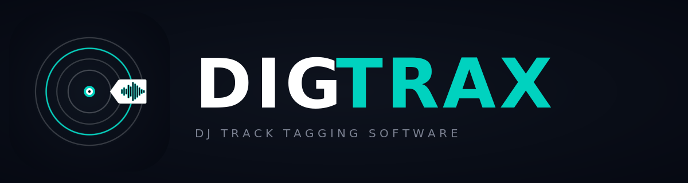

<p align='center'>
    
</p>

<h3 align='center'>The cross-platform music tagger for DJs</h3>

<p align='center'>
    
</p>

DigTrax is a cross-platform music metadata tagger built for DJs. It fetches metadata from Beatport, Traxsource, Juno Download, Discogs, MusicBrainz, and Spotify; supports a manual editor and a keyboard-driven Quick Tag editor with energy / mood / genre / custom-tag bindings; writes back to MP3, AIFF, FLAC, and M4A (AAC, ALAC) files; and ships a built-in dual-deck **DJ Mode** for auditioning + beat-matching tracks before you commit a tag.

Originally a fork of [OneTagger](https://github.com/Marekkon5/onetagger) by Marekkon5 — UI design originally by Bas Curtiz. DigTrax adds a redesigned UI, universal macOS builds, a streamlined Quick Tag workflow, and the DJ Mode mixer.

### DJ Mode (v1.8+)

Click the **DJ MODE** pill at the top-right of the player bar to flip the footer into a Mixxx-style dual-deck mixer:

- Drag tracks from Quick Tag onto either deck — the first deck loaded auto-becomes MASTER, the second auto-engages SYNC.
- Beat detection uses the same algorithms that ship in [Mixxx](https://github.com/mixxxdj/mixxx) — the [QM-DSP](https://github.com/c4dm/qm-dsp) library is vendored under `crates/digtrax-deck/vendor/qm-dsp/`. See [`CREDITS.md`](CREDITS.md) for full attribution.
- Per-deck rotary knobs for GAIN / HI / MID / LO and a vertical channel fader; per-deck tempo slider (±8%, vinyl-style); equal-power crossfader; ±1/4 beat jump.
- Closed-loop sync engine runs in the cpal audio callback (PI controller on beat-distance, gain 0.7, ±2% rate cap — Mixxx's `bpmcontrol.cpp::calcSyncedRate` exactly).

## Installing

Download the latest binaries for your platform from the [Releases](../../releases) page:
- **macOS**: `DigTrax-mac.zip` — universal binary (Apple Silicon + Intel)
- **Windows**: `DigTrax-windows-setup.exe` — installer
- **Linux**: `DigTrax-linux.tar.gz` — extracted binary

> ### ⚠ Why your OS warns on first launch
>
> DigTrax is **not yet code-signed or notarized**. We're a small project and haven't paid for an Apple Developer account ($99/yr) or a Windows code-signing certificate (~$120/yr) yet — see [`plan/03-code-signing.md`](plan/03-code-signing.md) for our roadmap. The app is safe; macOS and Windows just don't have a way to verify that without a paid certificate, so they show a generic warning. Here's how to allow it the first time:
>
> **macOS** — *"DigTrax can't be opened because Apple cannot check it for malicious software"* or *"DigTrax is damaged and can't be opened"*:
>
> 1. Move `DigTrax.app` to `/Applications` after unzipping.
> 2. Open **System Settings → Privacy & Security**, scroll to the bottom — you'll see *"'DigTrax' was blocked to protect your Mac"* with an **Open Anyway** button. Click it. (On macOS 12 and earlier the same option appears under *Security & Privacy → General → Open Anyway*.)
> 3. If step 2 doesn't show the prompt, the file may have a stale quarantine attribute. Open Terminal and run:
>    ```sh
>    xattr -cr /Applications/DigTrax.app
>    ```
>    Then double-click again.
> 4. You only need to do this **once per install** — subsequent launches open normally.
>
> **Windows** — *"Windows protected your PC"* SmartScreen prompt:
>
> 1. Click **More info**, then **Run anyway**.
> 2. The installer continues normally.
> 3. Same one-time-per-install: SmartScreen remembers your decision for that file.
>
> **Linux** — no warnings; just `tar xzf DigTrax-linux.tar.gz && ./digtrax`.

## Compiling

### Linux & macOS

Install dependencies: [rustup](https://rustup.rs), [Node.js](https://nodejs.org/), [pnpm](https://pnpm.io/installation).

On Linux also install:
```sh
sudo apt install -y lld autogen libasound2-dev pkg-config make libssl-dev gcc g++ curl wget git libwebkit2gtk-4.1-dev
```

Compile the UI:
```sh
cd client && pnpm i && pnpm run build && cd ..
```

Compile the app:
```sh
cargo build --release
```

Output: `target/release/digtrax` (and `target/release/digtrax-cli`).

### Universal macOS build (Apple Silicon + Intel)

```sh
rustup target add x86_64-apple-darwin aarch64-apple-darwin
cd client && pnpm i && pnpm run build && cd ..
cargo build --release --target aarch64-apple-darwin
cargo build --release --target x86_64-apple-darwin
lipo -create -output target/release/digtrax \
  target/aarch64-apple-darwin/release/digtrax \
  target/x86_64-apple-darwin/release/digtrax
cargo bundle --release
lipo -create -output target/release/bundle/osx/DigTrax.app/Contents/MacOS/digtrax \
  target/aarch64-apple-darwin/release/digtrax \
  target/x86_64-apple-darwin/release/digtrax
codesign --force --deep -s - target/release/bundle/osx/DigTrax.app
```

Output: `target/release/bundle/osx/DigTrax.app` — runs natively on both architectures.

### Windows

Install dependencies: [rustup](https://rustup.rs), [Node.js](https://nodejs.org/), [Visual Studio 2019 Build Tools](https://aka.ms/vs/16/release/vs_buildtools.exe), [pnpm](https://pnpm.io/installation).

```sh
cd client && pnpm i && pnpm run build && cd ..
cargo build --release
```

Output: `target\release\digtrax.exe`.

## Migration from OneTagger

DigTrax automatically migrates user settings from any existing OneTagger install on first launch — your folder paths, mood/energy bindings, custom tag definitions, and platform auth tokens carry over. The original OneTagger config dir is left untouched as a backup; the new DigTrax config dir is created alongside it.

## Credits

- **Marekkon5** — Original OneTagger
- **Bas Curtiz** — Original UI design
- **SongRec** (Shazam support) — https://github.com/marin-m/SongRec
- **Mixxx Development Team** — DJ Mode beat detection pipeline (DigTrax v1.8+ vendors QM-DSP and replicates Mixxx's `analyzerqueenmarybeats` data flow). https://github.com/mixxxdj/mixxx
- **Centre for Digital Music, Queen Mary University of London** — [QM-DSP library](https://github.com/c4dm/qm-dsp) (CSD onset detection + TempoTrackV2 beat tracker)
- **Mark Borgerding** — [kissfft](https://github.com/mborgerding/kissfft), bundled with QM-DSP

## License

DigTrax is distributed under the **GNU General Public License version 3** (see [`LICENSE`](LICENSE)). Third-party software incorporated into DigTrax — including QM-DSP and kissfft (both GPL-2-or-later) used by DJ Mode — is documented in [`CREDITS.md`](CREDITS.md). The DigTrax binary is therefore an aggregate work distributed as GPL-3 in full.
